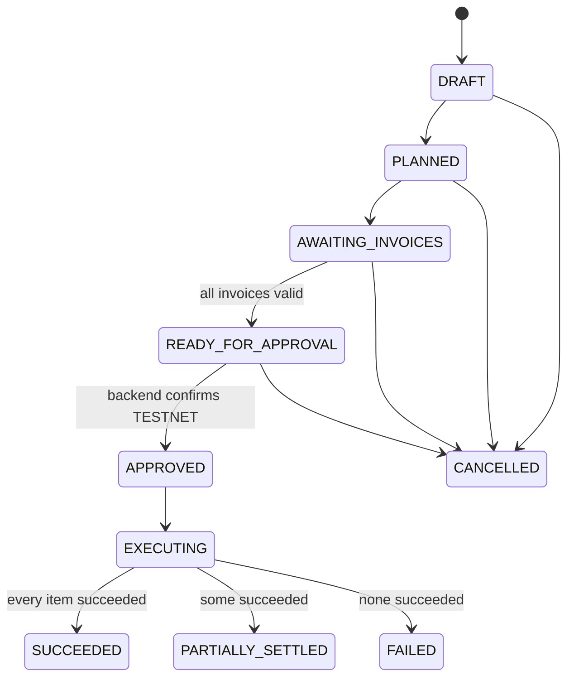
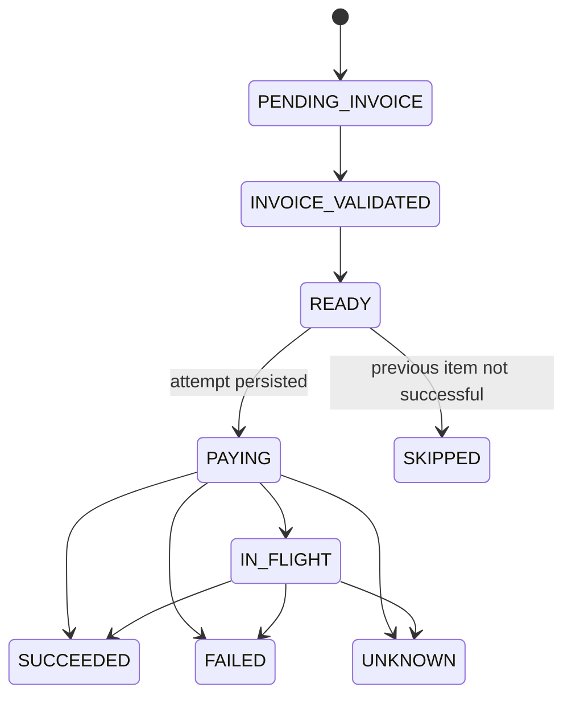
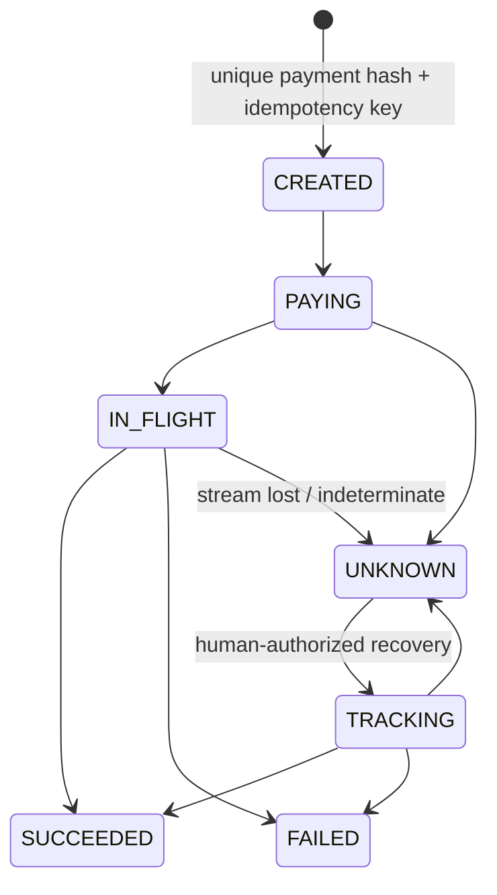

# Settlement state machines

No transition authorizes money movement by itself: backend approval and persisted attempts are separate mandatory controls.

```mermaid
stateDiagram-v2
  [*] --> DRAFT
  DRAFT --> PLANNED
  PLANNED --> AWAITING_INVOICES
  AWAITING_INVOICES --> READY_FOR_APPROVAL: all invoices valid
  READY_FOR_APPROVAL --> APPROVED: backend confirms TESTNET
  APPROVED --> EXECUTING
  EXECUTING --> SUCCEEDED: every item succeeded
  EXECUTING --> PARTIALLY_SETTLED: some succeeded
  EXECUTING --> FAILED: none succeeded
  DRAFT --> CANCELLED
  PLANNED --> CANCELLED
  AWAITING_INVOICES --> CANCELLED
  READY_FOR_APPROVAL --> CANCELLED
```

```mermaid
stateDiagram-v2
  [*] --> PENDING_INVOICE
  PENDING_INVOICE --> INVOICE_VALIDATED
  INVOICE_VALIDATED --> READY
  READY --> PAYING: attempt persisted
  PAYING --> IN_FLIGHT
  PAYING --> SUCCEEDED
  PAYING --> FAILED
  PAYING --> UNKNOWN
  IN_FLIGHT --> SUCCEEDED
  IN_FLIGHT --> FAILED
  IN_FLIGHT --> UNKNOWN
  READY --> SKIPPED: previous item not successful
```

```mermaid
stateDiagram-v2
  [*] --> CREATED: unique payment hash + idempotency key
  CREATED --> PAYING
  PAYING --> IN_FLIGHT
  IN_FLIGHT --> SUCCEEDED
  IN_FLIGHT --> FAILED
  IN_FLIGHT --> UNKNOWN: stream lost / indeterminate
  PAYING --> UNKNOWN
  UNKNOWN --> TRACKING: human-authorized recovery
  TRACKING --> SUCCEEDED
  TRACKING --> FAILED
  TRACKING --> UNKNOWN
```
